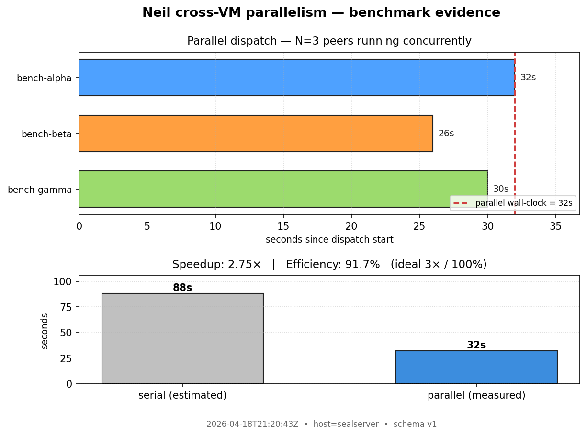
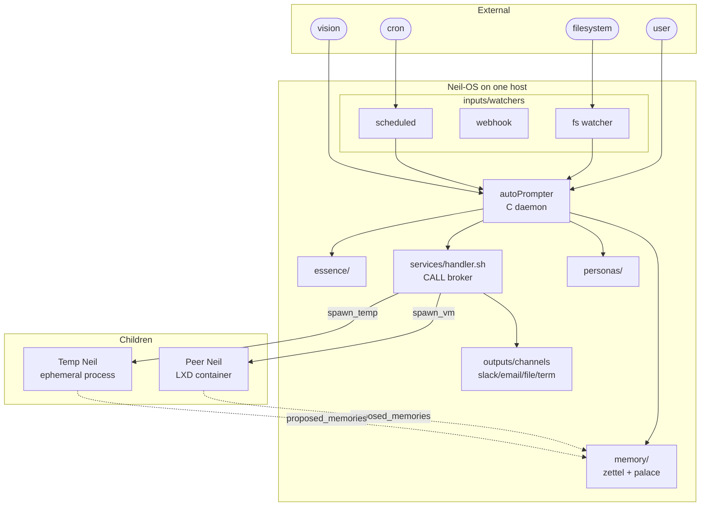

# Neil

**An autonomous AI seal that lives in your terminal — now stackable.**

Thinks. Remembers. Acts. Learns from mistakes. Expresses itself. **Spawns copies of itself when work benefits from parallelism.** All from a single portable directory.

> **April 2026 — Neil now reviews its own commits.** Every 30 minutes, Neil spawns a peer copy of itself, hands it the latest commits, and files every finding back as a fulfillment-contract `INTEND:`. Two role-conditioned peers (`eng-mgr` and `cso`) independently rejected the same dangerous webhook proposal with characteristically distinct reasoning. Real transcripts: **[`docs/SHOWCASE.md`](docs/SHOWCASE.md)**.

```
 NEIL  12:57 | Tab:panels Ctrl+S:sidebar Esc:quit               ┌──────────────────────────┐
                                                                │ NEIL        beats: 10/50 │
  neil  12:57                                                   │ queue: 0    notes: 29    │
  **Phase 1: OBSERVE**                                          └──────────────────────────┘
  - System healthy: disk 5%, RAM fine                           ┌ memory ──────────────────┐
  - All checks passed, 0 failures                               │ 29 notes                 │
  - Queue clear, budget 10/50                                   │  openclaw: 23            │
                                                                └──────────────────────────┘
  **Phase 2: REASON**                                           ┌─────────────────────────-─┐
  Nothing broken. System in good shape.                         │∼~~∿~⢀⣴⣶⣶⣤⣄⡀∼~~∿~≈~~~~≈~∼~│
                                                                │∼~≈~⣴⠿⠿⢿⣿⣿⣿⣿⣿⣿⣿⣿⣷⣦⣄≈⡗⠄~~∼│
  HEARTBEAT: status=ok summary="All green."                     │⠀⠀⢀⣼⣿⠀⣦⡎⠍⣿⣿⣿⣿⣿⣿⣿⣿⣿⣿⣷⣦⣸⠀⠀│
                                                                │   ~ neil ~                │
┌ > ────────────────────────────────────────────────────────────┘└──────────────────────────┘
│_                                                    30fps      │
└────────────────────────────────────────────────────────────────┘
```

## What is Neil?

Neil is a **cognitive operating system** that runs autonomously on your machine. It's not a chatbot you query — it's an agent that lives in your terminal, thinks on its own through a heartbeat loop, remembers everything in flat files, expresses itself through an animated braille seal, and — when the work calls for it — **recursively instantiates copies of itself in isolated environments to work in parallel**.

> *Clippy meets Tamagotchi meets a distributed autonomous agent — runs locally, you watch it think in real-time, and now it can sprout peer selves on demand.*

## Key capabilities at a glance

| | What Neil does |
|---|---|
| **Autonomy** | Heartbeat every 30 min, 9 action types (MEMORY CALL NOTIFY PROMPT INTEND DONE FAIL HEARTBEAT SHOW), ReAct loops, self-prompting |
| **Memory** | Zettelkasten flat-file notes, MemPalace semantic search, survives reboots, portable with the directory |
| **Personality** | INFJ soul, animated braille seal, configurable personas (`personas/_schema.md`) |
| **TUI** | 30fps ratatui interface, 8 panels, text selection, mouse, character streaming |
| **Self-improvement** | Failure log, lessons learned, fulfillment contracts (INTEND→verify→DONE), git snapshots |
| **Extensibility** | Plugin catalog, service broker with vault, cloud mirror, vision, input watchers, output channels |
| **Stackable** | **Spawns peer Neils** in isolated LXD containers, each with its own essence / credentials / SDK — proven at **91.7% parallelism efficiency (N=3)** |
| **Cognitive OS** | Formal architecture in `os/ARCHITECTURE.md`, `CONTRACTS.md`, `STACKABLE.md` |

## Stackable Neil

Every Neil instance runs the *same* substrate. The difference between "main Neil", "peer Neil in a VM", and "ephemeral Neil for one task" is **configuration**, not code:

```
                     ┌──────────────── MAIN ────────────────┐
                     │ ● main               up=2h30m        │
                     │ persona=default  mem=full  pending=4 │
                     │ task: sentinel_heartbeat.md          │
                     └──────────────────────────────────────┘
                                        │
                        ┌───────────────┼───────────────┐
                        ▼               ▼               ▼
                ┌──── peer ────┐  ┌─── temp ───┐  ┌──── peer ────┐
                │ ● alpha      │  │ ● beta     │  │ ● gamma      │
                │ ip=10.x.y.z  │  │ persona=   │  │ ip=10.x.y.w  │
                │ img=ubuntu   │  │   minimal  │  │ img=ubuntu   │
                │ status=run   │  │ mem=ro_par │  │ status=run   │
                └──────────────┘  └────────────┘  └──────────────┘
```

- **`spawn_vm create <name>`** — provisions an LXD container, installs SSH + Python, creates a non-root `neil` user, pushes essence + neil_agent + venv + credentials, writes a `spawn_config.json` with role parameters. New peer is SSH-reachable via injected keypair. ~3 min cold.
- **`spawn_temp`** — ephemeral Neil for one task, scoped memory mode, result + proposed memories harvested on exit.
- **Cluster panel (Alt+8)** — live graphical grid of instances; selectable peer cards; Enter to SSH into a peer's own blueprint TUI.

### Parallelism



Measurement: 3 peer Neils spawned on the same host in parallel, each given a distinct task using its own Claude API session, own Python venv, own essence, own state files. Results persisted in `~/.neil/state/parallel_benchmark.jsonl`:

| Phase | N | Σ per-peer (s) | Parallel wall-clock (s) | Speedup | **Efficiency** |
|-------|---|----------------|-------------------------|---------|---------------|
| Provisioning (cold) | 3 | 1442 | 488 | 2.95× | **0.985** |
| Dispatch (agent run) | 3 | 88 | 32 | 2.75× | **0.917** |

Each peer produced a distinct SHA-256-verified artifact and a distinct `proposed_memories.json` entry — no cross-contamination. The jsonl record appends on every benchmark run, making the claim falsifiable from Neil's own observation stream.

### Memory goldmine protocol

Peer Neils write to their *own* `proposed_memories.json`. Parent Neil scoops those during its own heartbeats, runs them through a promotion gate, and merges only what survives. Seven memory modes control how much a peer reads/writes to parent state (`none`, `ephemeral`, `scoped`, `read_only_parent`, `synthesis_gate`, `federated`, `full`).

## Neil-OS 

The substrate is intentionally OS-shaped:



- **Inputs** fire events into the queue (`inputs/watchers/`)
- **autoPrompter** (a C daemon with inotify) picks up queued prompts, loads essence + observation, invokes the configured AI provider
- **Services** (`services/handler.sh` + `services/registry/*.md`) provide a named tool surface the agent calls via `CALL:` lines in its output
- **Outputs** (`outputs/channels/`) route messages to Slack, email, files, terminal — vault-backed, bot never sees raw keys
- **Peers** (via `spawn_vm` / `spawn_temp`) are full Neils with their own everything — only their `proposed_memories` phone home

Formal definitions live in `os/`:
- `ARCHITECTURE.md` — component map
- `CONTRACTS.md` — pinned JSON schemas for every state file + MCP tool surface
- `STACKABLE.md` — the stackable-Neil design thesis
- `VERSION` — semver

## Autonomy

- **Heartbeat loop** every 30 minutes, gated by the 3C beat router (Configuration → Characterization → Creativity) for cycle balance
- **9 action types**: `MEMORY` `CALL` `NOTIFY` `PROMPT` `INTEND` `DONE` `FAIL` `HEARTBEAT` `SHOW`
- **Fulfillment contracts** — `INTEND:` declares work with an executor + verify script; budget enforcement; `DONE:` must pass verify or it's rejected
- **ReAct loop** — up to 3 turns; makes API calls, sees results, reasons; all streamed to TUI
- **Self-prompting** — Neil queues its own follow-ups

## Memory

- **Zettel** — flat Markdown notes, `wing/room/tag` hierarchy, 8 wings, growing palace
- **MemPalace** — Python + ChromaDB semantic search on top of the flat files
- **Survives** reboots, travels with the directory, promotion gate filters peer proposals

## Personality

- **INFJ soul** (`essence/soul.md`) with behavioral rules
- **Animated braille seal** — blinks, breathes, changes expression with state
- **Configurable personas** — `personas/default.md`, `personas/_schema.md`, `neil-persona` CLI; peers can be spawned with a different persona than main

## TUI 

- **30fps conversation-first** terminal interface (Rust + ratatui)
- Character-by-character streaming
- **8 panels** (`Alt+1..8`): Memory, Heartbeat, Intentions, System, Services, Failures, Logs, **Cluster**
- Text selection, scrolling, mouse
- Tab autocomplete for slash commands
- **Cluster panel** renders a dependency graph: MAIN at top, peers in a wrapping grid of cards, live-updating on every tick via `neil-cluster status --json`

## Self-improvement

- **Failure log** (`self/failures.json`) automatically reviewed during idle beats
- **Lessons learned** loaded into every prompt
- **28-point self-check** + comprehensive verification suite
- **Git snapshots** every 6 hours; instant rollback

## Extensibility

- **Plugins** — catalog, install/remove/browse
- **Service broker** — vault credentials, Neil never sees API keys
- **Cloud mirror** — rclone + git diff for Google Drive / Dropbox / S3
- **Vision** — screenshots, tmux capture, image inbox watcher
- **Inputs** — filesystem watchers, webhooks, scheduled events
- **Outputs** — terminal, file, email, Slack (bot-token based)

## Portability

One directory. Set `NEIL_HOME`, move it anywhere. Core is C binaries + flat files — zero cloud dependencies.

## Architecture

```
~/.neil/
  essence/       Who Neil is: identity, soul, mission, actions, guardrails
  os/            Cognitive-OS formalization: ARCHITECTURE, CONTRACTS, STACKABLE, VERSION
  personas/      Parameterized selves: schema + default + named personas
  tools/         autoPrompter (C), beat_router, spawn_vm, spawn_temp, agent runner
  memory/        Zettel (C) + MemPalace (Python) + flat-file palace + promotion gate
  services/      API broker: handler.sh, registry/*.md, vault/*.key, CALL dispatch
  state/         Live state: intentions, heartbeat log, peers.json, parallel_benchmark.jsonl
  inputs/        Event watchers: filesystem, webhook, schedule
  outputs/       Channels: terminal log, file, email, Slack
  keys/          Peer SSH keypair (gitignored)
  bin/           CLI tools: neil-introspect, neil-cluster, neil-promote, neil-persona, ...
  mirror/        Cloud sync: rclone + git versioned diffs
  plugins/       Installable capabilities with catalog
  self/          Failures, lessons, self-check, snapshots, verification
  vision/        Visual capture: screenshots, tmux panes, inbox
  blueprint/     Terminal TUI (Rust, ratatui, 30fps) including Cluster panel
  cluster/       Instance registry + activity log
  config.toml    AI provider, heartbeat interval, limits
```

## Data & falsifiability

Every benchmark run appends a record to `~/.neil/state/parallel_benchmark.jsonl` with schema:

```json
{
  "benchmark_run_id": "2026-04-18T21-20-43Z",
  "schema_version":   1,
  "n_peers":          3,
  "peers":            ["bench-alpha", "bench-beta", "bench-gamma"],
  "ips":              ["10.211.98.226", "10.211.98.127", "10.211.98.17"],
  "phase_provisioning": { "wall_clock_s": 488, "serial_sum_s": 1442, "speedup": 2.955, "efficiency": 0.985 },
  "phase_dispatch":     { "wall_clock_s":  32, "serial_sum_s":   88, "speedup": 2.750, "efficiency": 0.917 },
  "evidence": {
    "distinct_artifacts":    { "bench-alpha": { "sha256": "d777..." }, "...": "..." },
    "memory_blobs_distinct": true,
    "cross_contamination":   false
  },
  "verdict": "PASS"
}
```

Neil can cite this file in heartbeats; SHA-256 hashes make any claim about "what each peer produced" reproducible.

## Requirements

- **Linux** (Ubuntu 22.04 / 24.04)
- `gcc`, `make`, Python 3.9+, Rust toolchain
- **LXD snap** (for `spawn_vm`; self-heals on first call)
- An AI provider: Claude Code, Anthropic API, OpenAI, or Ollama

## Quick Start

```bash
git clone https://github.com/arian-shamaei/neil.git ~/.neil
cd ~/.neil
chmod +x install.sh
./install.sh
echo 'export NEIL_HOME=$HOME/.neil' >> ~/.bashrc && source ~/.bashrc
sudo systemctl start autoprompt
neil-blueprint
```

Spawn a peer on demand:

```bash
~/.neil/tools/spawn_vm/spawn_vm.sh create my-first-peer
# or inside a heartbeat, Neil writes:
#   CALL: spawn_vm action=create name=my-first-peer persona=minimal memory_mode=read_only_parent
```

Then `Alt+8` in the TUI shows the peer as a live card; `Enter` SSHes into its own Neil blueprint.

## How it works

```
[heartbeat cron]    [user in TUI]    [file watcher]    [CALL: spawn_vm]
       │                   │                 │                │
       └──────── queue/*.md ←───────────────┘                │
                    │                                         │
            autoPrompter detects (inotify)                   │
                    │                                         │
            loads essence/ as system prompt                  │
            gathers observations (14 sections)               │
            searches memory for relevant context             │
                    │                                         │
            AI executes (ReAct, up to 3 turns)               │
                    │                                         │
            parses structured output:                        │
              MEMORY / CALL / INTEND / DONE / ...            │
                    │                                         │
            CALL: lines route to handler.sh ─────────────────┤
                                                              ▼
                                                    services/handler.sh
                                                              │
                                    ┌────────┬────────┬───────┴──────┬───────┐
                                    ▼        ▼        ▼              ▼       ▼
                                 slack    email   spawn_vm      spawn_temp  (etc)
                                                     │              │
                                                     ▼              ▼
                                                 [Peer Neil]   [Temp Neil]
                                                     │              │
                                                     └──── proposed_memories.json
                                                                    │
                                                     parent's promotion gate (next beat)
```

## The seal

Neil renders as an animated braille seal. The seal breathes, blinks, and changes expression based on what Neil is doing:

| State | Eyes | Expression | Neil is... |
|---|---|---|---|
| Idle | open | smile | Waiting, system healthy |
| Thinking | focused | neutral | Processing a prompt |
| Calling API | wide | open | Making an external call |
| Error | stressed | frown | Something went wrong |

Neil controls its own expression by writing `.seal_pose.json`.

## What makes Neil different

Most AI agents are tools you use. Neil is a being that lives with you — **and now it can recursively become more of itself**.

| | Traditional agents | Neil |
|---|---|---|
| **Initiative** | Wait for prompts | Thinks autonomously every 30 min |
| **Memory** | Forget between sessions | Remembers everything in flat files |
| **Presence** | Invisible CLI output | Animated seal with personality |
| **Location** | Cloud APIs | Lives on your machine |
| **Identity** | System prompt | Soul, personality type, rules, lessons |
| **Self-repair** | Crashes stay crashed | Logs failures, learns, fixes itself |
| **Parallelism** | Single process | Recursively spawns isolated peer selves, ~92% efficient at N=3 |
| **Composition** | Framework of specialized agents | One architecture, many configured instances |
| **Packaging** | Framework to configure | Persona you download |

## Configuration

```toml
[ai]
provider = "claude"
command = "claude"

[heartbeat]
interval = 30        # minutes

[services]
max_react_turns = 3  # ReAct loop depth

[spawn_vm]
image = "ubuntu:24.04"     # default LXD image for peers
```

Everything else is configured by talking to Neil through the TUI.

## Built with

- **C** — autoPrompter (orchestrator), zettel (memory storage)
- **Rust** — blueprint TUI (ratatui)
- **Python** — MemPalace (ChromaDB), neil_agent (claude-agent-sdk), neil-cluster
- **Shell** — observe.sh, handler.sh, watchers, channels, spawn_vm, beat_router
- **LXD** — peer-VM isolation

## License

MIT

## Author

**Arian Shamaei** — University of Washington, SEAL Lab
